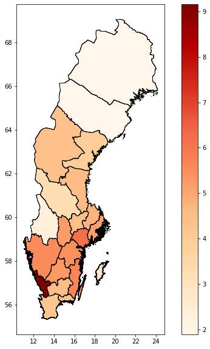
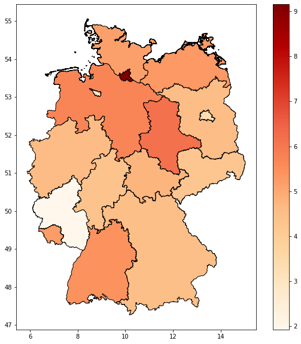
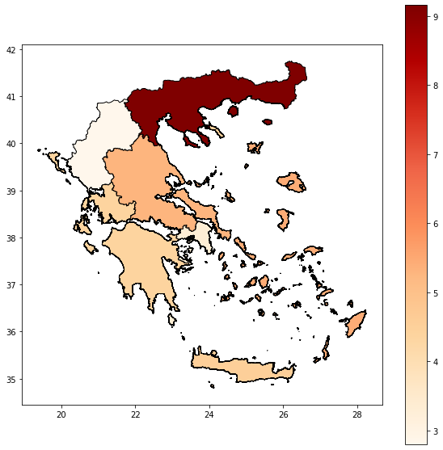
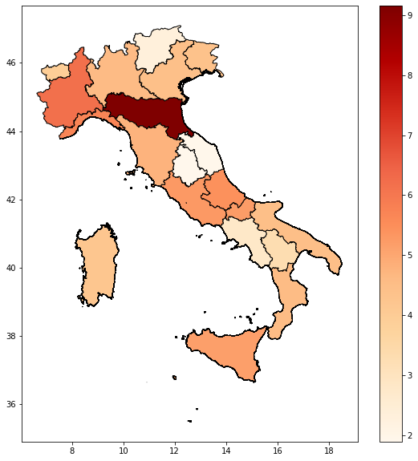
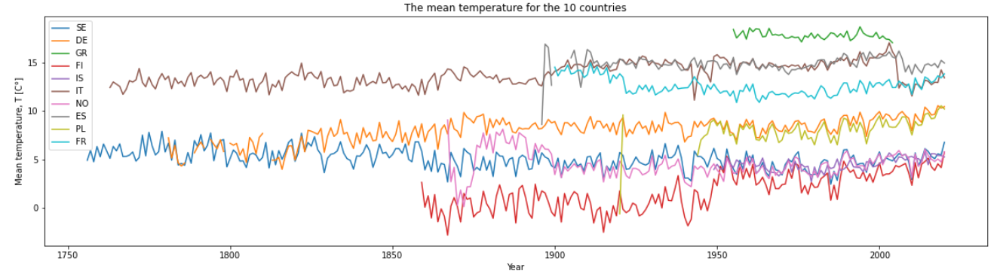
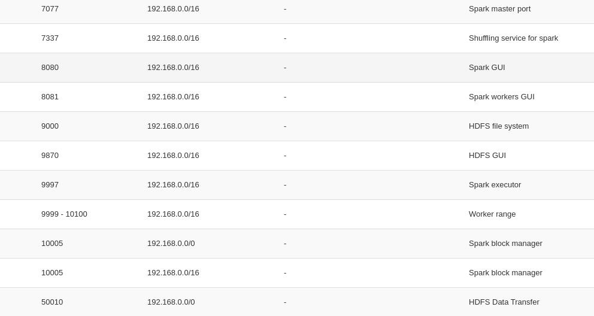

## Results

For the heatmap analysis, we used the mean temperature (TG) of the weather stations.
The shape files used to generate the maps are taken from [here](https://www.diva-gis.org/gData).






Moreover, TG was used as well to for the time series analysis. In this case, the moving average was used to get the mean temperature of each year
for the 10 countries.



## Requirements

### Heatmap

Libraries:
```
pip install pycountry pex geopandas shapely pyspark dms2dec
```

pex file to ship some packages to spark

```
pex pyarrow dms2dec shapely pyspark geopandas -o pyspark_pex_env.pex
```

>>>>>>> 0a17c6f0497dd73e0932809258ce29c0d86c5022
## How to create the cluster

Note that every time you include a new node later on, you need to go back to the other nodes
in the cluster and make some changes as well such as including them in `/etc/hostname` and
`hadoop/etc/hadoop/workers` for main node.

<<<<<<< HEAD
- Include security group for instances (coming soon)
=======
- Include security group for instances
    - For the client, open 9998-10050 TCP
    - Ports for the cluster

 
>>>>>>> 0a17c6f0497dd73e0932809258ce29c0d86c5022

- update and install java jdk
```sh
sudo apt update
sudo apt install default-jdk
```

- Include the worker hostname in `/etc/hostname` of the reset of workers and main.

- Include in `/etc/hosts` the name of the nodes of the cluster and the clients who will use the cluster  \
E.g.
```sh
# include in /etc/hosts the workers and main and remove first line with localhost
# e.g.
192.168.2.173 main
192.168.2.36 worker1
192.168.2.168 worker2
192.168.2.7 worker3
192.168.2.103 worker4

# client that will use the cluster
192.168.2.75 client
```


### Spark
- Download spark (make sure to have the right version of spark)

```sh
wget https://ftpmirror1.infania.net/mirror/apache/spark/spark-3.1.1/spark-3.1.1-bin-hadoop3.2.tgz
tar xvf spark-3.1.1-bin-hadoop3.2.tgz
sudo mv spark-3.1.1-bin-hadoop3.2 /usr/local/spark
sudo chown -R ubuntu:ubuntu /usr/local/spark
rm spark-3.1.1-bin-hadoop3.2.tgz

# include this to config /user/local/spark/config/spark-defaults.conf for all
# workers
# we need to include this because dynamic allocation is used
spark.shuffle.service.enabled true

# include export in bashrc
export SPARK_HOME=/usr/local/spark
export PATH=$PATH:$SPARK_HOME/bin:$SPARK_HOME/sbin

source ~/.bashrc

### ON MAIN
start-master.sh

### ON WORKERS
start-worker.sh spark://main:7077
```

- Check that the main/worker is working using `jps` and 8080 port.


## HDFS

- Download Hadoop
```sh
# for MAIN only
# SSH connection between nodes
ssh-keygen -b 4096
ssh-copy-id -i $HOME/.ssh/id_rsa.pub ubuntu@main

# for each worker do this (IF YOU CREATED A NEW WORKER, INCLUDE THIS AS WELL)
# ON MAIN E.g.
ssh-copy-id -i $HOME/.ssh/id_rsa.pub ubuntu@worker1
ssh-copy-id -i $HOME/.ssh/id_rsa.pub ubuntu@worker2
ssh-copy-id -i $HOME/.ssh/id_rsa.pub ubuntu@worker3
ssh-copy-id -i $HOME/.ssh/id_rsa.pub ubuntu@worker4


# for MAIN and WORKERS
wget https://ftpmirror1.infania.net/mirror/apache/hadoop/common/hadoop-3.3.0/hadoop-3.3.0.tar.gz
tar -xzf hadoop-3.3.0.tar.gz
sudo mv ~/hadoop-3.3.0 /usr/local/hadoop
sudo chown -R ubuntu:ubuntu /usr/local/hadoop
sudo rm ~/hadoop-3.3.0.tar.gz

sudo mkdir -p /usr/local/hadoop_store/hdfs/namenode
sudo mkdir -p /usr/local/hadoop_store/hdfs/datanode

sudo chown -R ubuntu:ubuntu /usr/local/hadoop_store/hdfs/namenode
sudo chown -R ubuntu:ubuntu /usr/local/hadoop_store/hdfs/datanode

# include in .bashrc
export JAVA_HOME=/usr/lib/jvm/default-java

################HADOOP VARIABLES########################################
export HADOOP_INSTALL=/usr/local/hadoop
export PATH=$PATH:$HADOOP_INSTALL/bin
export PATH=$PATH:$HADOOP_INSTALL/sbin
export HADOOP_MAPRED_HOME=$HADOOP_INSTALL
export HADOOP_COMMON_HOME=$HADOOP_INSTALL
export HADOOP_HDFS_HOME=$HADOOP_INSTALL
export YARN_HOME=$HADOOP_INSTALL
export HADOOP_COMMON_LIB_NATIVE_DIR=$HADOOP_INSTALL/lib/native
export HADOOP_OPTS="-Djava.library.path=$HADOOP_INSTALL/lib"
#HADOOP VARIABLES END

source ~/.bashrc

# ON MASTER
cd /usr/local/hadoop/etc/hadoop/

# include in hadoop-env.sh
export JAVA_HOME=/usr/lib/jvm/default-java

# include in core-site.xml
<property>
    <name>fs.default.name</name>
    <value>hdfs://main:9000</value>
</property>

# include in hdfs-site.xml
<property>
    <name>dfs.replication</name>
    <value>1</value>
    <description>
        Default block replication.
        The actual number of replications can be specified when the file is created.
        The default is used if replication is not specified in create time.
    </description>
</property>
<property>
    <name>dfs.namenode.name.dir</name>
    <value>file:/usr/local/hadoop_store/hdfs/namenode</value>
</property>
<property>
    <name>dfs.datanode.data.dir</name>
    <value>file:/usr/local/hadoop_store/hdfs/datanode</value>
</property>

# include in workers  (IF YOU CREATED A NEW WORKER, INCLUDE THIS AS WELL)
worker1
worker2
worker3
worker4

# for each worker (IF YOU CREATED A NEW WORKER, INCLUDE THIS AS WELL)
scp /usr/local/hadoop/etc/hadoop/* ubuntu@worker1:/usr/local/hadoop/etc/hadoop/
scp /usr/local/hadoop/etc/hadoop/* ubuntu@worker2:/usr/local/hadoop/etc/hadoop/
scp /usr/local/hadoop/etc/hadoop/* ubuntu@worker3:/usr/local/hadoop/etc/hadoop/
scp /usr/local/hadoop/etc/hadoop/* ubuntu@worker4:/usr/local/hadoop/etc/hadoop/

# starting HDFS
hdfs namenode -format
start-dfs.sh
```

- Check that the main/worker is working using `jps` and port 9870
<<<<<<< HEAD
=======

>>>>>>> 0a17c6f0497dd73e0932809258ce29c0d86c5022
